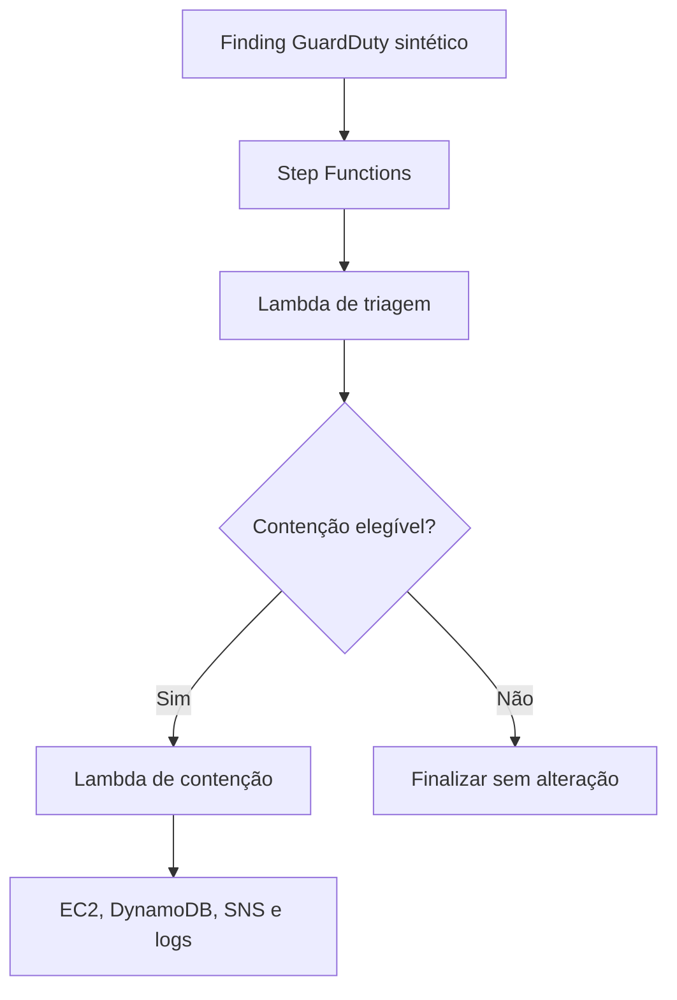

# AWS Cloud Incident Response Automation Lab

Laboratório de resposta a incidentes em AWS que transforma triagem e contenção de uma instância EC2 em código. O projeto usa Terraform, AWS Lambda, Python e PowerShell para validar um fluxo controlado, auditável e idempotente, baseado em um finding sintético do Amazon GuardDuty.

> Status atual: fundação segura, triagem, contenção controlada e orquestração com AWS Step Functions implementadas e validadas em AWS.

## Objetivos

Este projeto foi construído para demonstrar competências práticas esperadas em uma operação de Cloud Security e SecOps:

- analisar e enriquecer findings de segurança em ambientes AWS;
- transformar playbooks manuais em automações Python;
- aplicar contenção de EC2 com controles fail-closed;
- orquestrar decisões de resposta com AWS Step Functions;
- implementar privilégio mínimo com IAM;
- preservar estado e idempotência com DynamoDB;
- registrar evidências operacionais em CloudWatch Logs;
- notificar a operação por SNS;
- provisionar e validar a infraestrutura com Terraform;
- produzir testes, runbooks e documentação post-mortem.

## Cenário de incidente

O laboratório utiliza um evento no formato do Amazon EventBridge que representa um finding de criptomineração em EC2:

```text
CryptoCurrency:EC2/BitcoinTool.B!DNS
```

A triagem associa esse comportamento à técnica [MITRE ATT&CK T1496.001 — Compute Hijacking](https://attack.mitre.org/techniques/T1496/001/), da tática **Impact**.

O finding é sintético. O projeto não depende de atividade maliciosa real e, no estágio atual, não habilita um detector GuardDuty nem cria automaticamente uma regra EventBridge.

## Arquitetura



O workflow Standard invoca a triagem e usa uma decisão explícita para encaminhar somente findings elegíveis à contenção. O `Test-Orchestration.ps1` valida o caminho seguro por padrão e exige o parâmetro explícito `-ExecuteContainment` para o caminho elegível. Nesse modo autorizado, o script coleta evidências e restaura automaticamente o alvo no bloco `finally`. A contenção também possui validação ponta a ponta independente por `Test-Containment.ps1`.

## Componentes

| Componente | Responsabilidade |
| --- | --- |
| VPC e subnet isolada | Hospedam o alvo sem Internet Gateway, NAT Gateway ou rota padrão para a internet |
| Security group baseline | Estado normal do alvo; sem regras de entrada |
| Security group de quarentena | Bloqueia todo o tráfego durante a contenção |
| EC2 descartável | Alvo autorizado, sem IP público, com IMDSv2 obrigatório e volume raiz criptografado |
| Lambda de triagem | Normaliza o finding, consulta EC2, aplica guardrails e mapeia MITRE ATT&CK |
| Lambda de contenção | Revalida o alvo, troca o security group, altera a tag de estado e confirma a mutação |
| Step Functions | Orquestra triagem, decisão e contenção por um workflow Standard auditável |
| DynamoDB | Mantém o ledger do incidente, lease de processamento, idempotência e TTL |
| SNS | Envia a notificação de conclusão da contenção |
| CloudWatch Logs | Armazena logs estruturados das Lambdas com retenção limitada |
| S3 de evidências | Bucket privado, versionado e criptografado preparado para evidências do laboratório |
| Terraform | Provisiona, atualiza e verifica drift da infraestrutura |

## Controles de segurança

A contenção só pode ocorrer quando todas as condições abaixo são satisfeitas:

- severidade igual ou superior ao limite configurado;
- recurso afetado do tipo EC2 Instance;
- instância em estado suportado;
- instância igual ao alvo explicitamente permitido;
- tag `AutoContainment=true`;
- tag `DataClassification=synthetic`;
- tag inicial `IncidentStatus=clean`;
- exatamente uma interface de rede;
- somente o security group baseline associado;
- security group de quarentena sem nenhuma regra.

A Lambda de contenção consulta novamente a EC2 imediatamente antes da mutação. Ela não confia somente no snapshot produzido pela triagem.

As permissões de alteração são limitadas à instância descartável e ao security group de quarentena gerenciados pelo Terraform. Os recursos reais não são codificados diretamente no repositório.

## Idempotência e estado do incidente

A tabela DynamoDB utiliza `incident_id` como chave e registra, entre outros campos:

- `processing`, `contained` ou `failed`;
- identificador da instância;
- tipo e severidade do finding;
- técnica MITRE;
- security groups antes e depois da contenção;
- timestamps de criação, atualização e conclusão;
- lease temporário de processamento;
- TTL para expiração dos dados do laboratório.

Uma repetição do mesmo incidente concluído retorna `already_contained`, não modifica novamente a EC2, não repete a notificação e preserva o horário original da conclusão.

## Estrutura do repositório

```text
aws-cloud-ir-automation-lab/
├── docs/
│   ├── containment-validation.md
│   ├── foundation-validation.md
│   ├── orchestration-validation.md
│   └── triage-validation.md
├── events/
│   └── guardduty-crypto-ec2.json
├── infra/
│   ├── compute.tf
│   ├── containment.tf
│   ├── network.tf
│   ├── orchestration.tf
│   ├── outputs.tf
│   ├── providers.tf
│   ├── storage.tf
│   ├── terraform.tfvars.example
│   ├── triage.tf
│   ├── variables.tf
│   └── versions.tf
├── scripts/
│   ├── Test-Containment.ps1
│   ├── Test-Foundation.ps1
│   ├── Test-Orchestration.ps1
│   └── Test-Triage.ps1
├── src/
│   ├── containment/
│   │   ├── __init__.py
│   │   └── handler.py
│   └── triage/
│       ├── __init__.py
│       └── handler.py
├── tests/
│   ├── test_containment.py
│   └── test_triage.py
├── .gitignore
└── README.md
```

Arquivos `.tfstate`, `.tfvars`, pacotes ZIP de Lambda, planos salvos, caches e ambientes virtuais não devem ser versionados.

## Pré-requisitos

- Windows com PowerShell;
- AWS CLI v2 com suporte a `aws login`;
- Terraform CLI;
- Python e `venv`;
- conta AWS de laboratório;
- perfil `cloud-ir-signin` autenticado pelo navegador;
- perfil `cloud-ir-lab` configurado para exportar credenciais temporárias do perfil de login.

Exemplo conceitual da configuração local:

```ini
[profile cloud-ir-signin]
login_session = <identidade-autorizada>
region = us-east-1

[profile cloud-ir-lab]
credential_process = aws configure export-credentials --profile cloud-ir-signin --format process
region = us-east-1
```

Não armazene access keys no repositório.

## Autenticação para AWS CLI e Terraform

As credenciais de `aws login` são temporárias. Ao iniciar uma nova sessão de trabalho, autentique o perfil de entrada:

```powershell
aws login `
  --profile cloud-ir-signin `
  --region us-east-1
```

Selecione o perfil operacional para todos os SDKs executados no terminal, inclusive o AWS Provider do Terraform:

```powershell
$env:AWS_PROFILE = "cloud-ir-lab"
$env:AWS_REGION = "us-east-1"
$env:AWS_DEFAULT_REGION = "us-east-1"
$env:AWS_EC2_METADATA_DISABLED = "true"
```

Valide tanto o perfil explícito quanto a cadeia de credenciais que o Terraform utilizará:

```powershell
aws sts get-caller-identity --profile cloud-ir-lab
aws sts get-caller-identity
```

Os dois comandos devem retornar a mesma conta e identidade. Se o primeiro funcionar e o segundo falhar, `AWS_PROFILE` não foi definido corretamente na sessão atual.

As variáveis definidas com `$env:` permanecem somente no processo atual do PowerShell. Elas precisam ser configuradas novamente quando um novo terminal for aberto.

## Preparação local

Crie e ative o ambiente virtual:

```powershell
python -m venv .venv
.\.venv\Scripts\Activate.ps1
```

Instale as dependências usadas nos testes locais:

```powershell
python -m pip install --upgrade pip
python -m pip install boto3 pytest
```

Crie o arquivo local de variáveis:

```powershell
Copy-Item `
  ".\infra\terraform.tfvars.example" `
  ".\infra\terraform.tfvars"
```

Revise `infra/terraform.tfvars` e informe somente os valores do ambiente, como o endereço de notificação. Esse arquivo não deve ser commitado.

## Provisionamento

Inicialize e valide:

```powershell
terraform -chdir=".\infra" init
terraform -chdir=".\infra" fmt -recursive -check
terraform -chdir=".\infra" validate
```

Gere um plano revisável:

```powershell
terraform -chdir=".\infra" plan `
  -parallelism=1 `
  -out="cloud-ir-lab.tfplan"
```

Planos Terraform podem conter dados sensíveis. Não os envie ao Git.

Depois de revisar criação, alteração e destruição:

```powershell
terraform -chdir=".\infra" apply `
  ".\cloud-ir-lab.tfplan"
```

Confirme a assinatura recebida por e-mail para que o SNS possa entregar notificações.

## Testes

### Testes unitários

```powershell
python -m pytest ".\tests" -q
```

Resultado registrado:

```text
13 passed
```

### Fundação

```powershell
.\scripts\Test-Foundation.ps1
```

Resultado registrado:

```text
Passed: 26
Failed: 0
```

### Triagem

```powershell
.\scripts\Test-Triage.ps1
```

Resultado registrado:

```text
Passed: 27
Failed: 0
```

### Contenção controlada

Este teste altera o security group e a tag da instância descartável. Revise o script antes de executá-lo:

```powershell
.\scripts\Test-Containment.ps1 `
  -ExecuteContainment
```

Resultado registrado:

```text
Passed: 54
Failed: 0
```

O teste valida a primeira contenção e repete o mesmo incidente para comprovar idempotência. Ao final, o alvo permanece intencionalmente em quarentena.

### Orquestração

Este teste inicia um workflow Standard com severidade abaixo do limite de triagem. Ele valida a decisão sem executar a contenção nem modificar a instância:

```powershell
.\scripts\Test-Orchestration.ps1
```

Resultado registrado:

```text
Passed: 23
Failed: 0
```

O histórico confirmou `TriageFinding=entered` e `ContainTarget=not-entered`. Ao final, a instância permaneceu com `IncidentStatus=clean` e com o security group baseline.

O caminho elegível é executado somente com autorização explícita:

```powershell
.\scripts\Test-Orchestration.ps1 `
  -ExecuteContainment
```

Resultado registrado:

```text
Passed: 40
Failed: 0
```

Essa execução apresentou:

```text
Workflow:           SUCCEEDED
Resultado:          contained
Recurso alterado:   true
Idempotente:        false
Notificação:        published
Histórico:          TriageFinding -> EvaluateContainmentEligibility -> ContainTarget
DynamoDB:           status=contained, lease ausente e TTL presente
CloudWatch Logs:    event=containment_complete
```

O script armazena temporariamente o evento, a descrição e o histórico da execução, o item do DynamoDB, a resposta bruta da consulta ao CloudWatch, o evento de conclusão correlacionado e o estado de recuperação. Esses artefatos permanecem fora do Git porque contêm identificadores específicos da conta.

Após a coleta, o bloco `finally` restaura o security group baseline e `IncidentStatus=clean`. A regressão final confirmou a recuperação, `26/26` verificações da fundação e ausência de drift no Terraform.

## Recuperação do alvo

O modo `-ExecuteContainment` do teste de orquestração tenta restaurar o alvo automaticamente, inclusive quando uma asserção posterior falha. Confirme sempre o estado exibido no resumo.

O teste independente `Test-Containment.ps1` deixa o alvo intencionalmente em quarentena. Depois dessa demonstração, restaure o estado baseline:

```powershell
$labInstanceId = (
    terraform -chdir=".\infra" output -raw lab_instance_id
).Trim()

$baselineSgId = (
    terraform -chdir=".\infra" output -raw baseline_security_group_id
).Trim()

aws ec2 modify-instance-attribute `
  --instance-id $labInstanceId `
  --groups $baselineSgId `
  --profile cloud-ir-lab `
  --region us-east-1

aws ec2 create-tags `
  --resources $labInstanceId `
  --tags "Key=IncidentStatus,Value=clean" `
  --profile cloud-ir-lab `
  --region us-east-1
```

Execute novamente as validações de fundação e triagem depois da recuperação.

## Verificação de drift

```powershell
terraform -chdir=".\infra" plan `
  -parallelism=1 `
  -detailed-exitcode

$driftExitCode = $LASTEXITCODE
Write-Host "Terraform drift exit code: $driftExitCode"
```

Interpretação:

| Exit code | Significado |
| ---: | --- |
| `0` | Plano concluído sem diferenças |
| `1` | Erro durante o planejamento |
| `2` | Plano concluído com mudanças |

## Post-mortem: autorização EC2

O primeiro teste real de contenção falhou com `UnauthorizedOperation` em `ec2:ModifyInstanceAttribute`.

A política autorizava somente o ARN da instância, mas a operação também foi avaliada para o security group de destino. O Terraform foi corrigido para permitir a ação exatamente sobre a instância do laboratório e o security group de quarentena, sem utilizar `Resource = "*"`.

O alvo permaneceu no estado baseline após a falha, e o incidente foi registrado como `failed` no DynamoDB. Após a correção IAM, o teste completo passou nas 54 verificações.

Esse caso demonstra por que testes unitários com mocks devem ser complementados por testes ponta a ponta em uma conta isolada: mocks validam o comportamento da aplicação, mas não reproduzem integralmente a avaliação de autorização da AWS.

## Post-mortem: leitura transitória do S3

Depois da primeira validação da orquestração, um refresh do Terraform informou incorretamente que o bucket de evidências havia sido removido e propôs seis criações e cinco substituições.

O plano não foi aplicado. A investigação confirmou que o bucket continuava existente e acessível por `HeadBucket`, pela API tradicional de tags e por `s3control list-tags-for-resource`. O state também preservava os seis recursos S3. Depois da limpeza do cache DNS, um novo plano retornou `No changes` com exit code `0`.

O evento reforça uma regra operacional do projeto: planos com recriação inesperada de recursos persistentes nunca devem ser aplicados antes da validação direta do recurso e do endpoint usado pelo provider.

## Post-mortem: falso negativo na validação do CloudWatch

A primeira execução automatizada do caminho elegível concluiu corretamente a Step Functions, a contenção, a persistência no DynamoDB, a notificação SNS e a recuperação do alvo, mas o teste informou que não havia encontrado o evento `containment_complete`.

Uma consulta direta ao log group encontrou exatamente um evento para o mesmo incidente. O registro foi ingerido poucos segundos após sua emissão, descartando atraso prolongado como causa. O problema foi isolado ao filtro literal passado à AWS CLI pelo Windows PowerShell: a automação falhava ao localizar um evento que já estava armazenado.

O validador foi corrigido para:

- consultar o intervalo de tempo sem `--filter-pattern` e correlacionar localmente o ID do incidente e o nome do evento;
- iniciar a janela cinco minutos antes da execução;
- repetir a consulta até 20 vezes, com intervalo de três segundos;
- preservar a resposta bruta em `cloudwatch-query.json`;
- salvar as evidências de Step Functions e DynamoDB antes da asserção do CloudWatch;
- executar a recuperação automática em `finally`.

Depois da correção, o caminho seguro passou em `23/23`, o caminho elegível passou em `40/40`, a fundação passou em `26/26` e o Terraform confirmou ausência de drift.

## Custos e limpeza

O desenho evita NAT Gateway e mantém retenções curtas para reduzir custos. Mesmo assim, EC2, CloudWatch, SNS, DynamoDB, S3 e demais serviços podem gerar cobrança.

Quando o laboratório não for mais necessário, gere e revise primeiro o plano de destruição:

```powershell
terraform -chdir=".\infra" plan `
  -destroy `
  -out="destroy.tfplan"
```

Somente depois de confirmar os recursos listados:

```powershell
terraform -chdir=".\infra" apply `
  ".\destroy.tfplan"
```

O bucket S3 precisa estar vazio para ser removido, salvo se a configuração definir explicitamente outro comportamento. Trate a destruição como uma operação irreversível.

## Documentação

- [Validação da fundação](docs/foundation-validation.md)
- [Validação da triagem](docs/triage-validation.md)
- [Validação da contenção e post-mortem](docs/containment-validation.md)
- [Validação da orquestração](docs/orchestration-validation.md)

## Limitações atuais

- o finding GuardDuty é sintético;
- a state machine ainda é iniciada pelo script PowerShell;
- ainda não existe ingestão automática por GuardDuty/EventBridge nem aprovação humana;
- o modo elegível é explicitamente opt-in e limitado ao alvo descartável; a recuperação local é best-effort e ainda depende de credenciais e conectividade com a AWS;
- o bucket S3 está preparado para evidências, mas a contenção atual registra seu estado principal no DynamoDB e CloudWatch;
- o alvo suporta somente o cenário controlado de uma instância com uma interface de rede;
- o laboratório não substitui um processo forense ou uma estratégia de contenção de produção.

## Próximas evoluções

- habilitar GuardDuty e integrar findings por EventBridge;
- adicionar aprovação humana e recuperação controlada ao workflow;
- coletar snapshots e metadados forenses antes da contenção;
- armazenar evidências normalizadas no S3 com integridade verificável;
- publicar métricas operacionais de triagem e resposta;
- adicionar CI para testes Python, formatação e validação Terraform;
- adicionar controles DevSecOps, como análise estática e scan de credenciais.

## Referências

- [Amazon GuardDuty — EC2 finding types](https://docs.aws.amazon.com/guardduty/latest/ug/guardduty_finding-types-ec2.html)
- [Amazon EC2 — ModifyInstanceAttribute](https://docs.aws.amazon.com/AWSEC2/latest/APIReference/API_ModifyInstanceAttribute.html)
- [AWS CLI — login para desenvolvimento local](https://docs.aws.amazon.com/cli/latest/userguide/cli-configure-sign-in.html)
- [AWS SDKs and Tools — shared configuration profiles](https://docs.aws.amazon.com/sdkref/latest/guide/file-format.html)
- [AWS Step Functions — integração com Lambda](https://docs.aws.amazon.com/step-functions/latest/dg/connect-lambda.html)
- [AWS Step Functions — Choice state](https://docs.aws.amazon.com/step-functions/latest/dg/state-choice.html)
- [AWS Step Functions — tipos de workflow](https://docs.aws.amazon.com/step-functions/latest/dg/choosing-workflow-type.html)
- [Amazon CloudWatch Logs — FilterLogEvents API](https://docs.aws.amazon.com/AmazonCloudWatchLogs/latest/APIReference/API_FilterLogEvents.html)
- [Terraform plan command](https://developer.hashicorp.com/terraform/cli/commands/plan)
- [MITRE ATT&CK T1496.001 — Compute Hijacking](https://attack.mitre.org/techniques/T1496/001/)
- [NIST Cybersecurity Framework 2.0](https://www.nist.gov/cyberframework)
