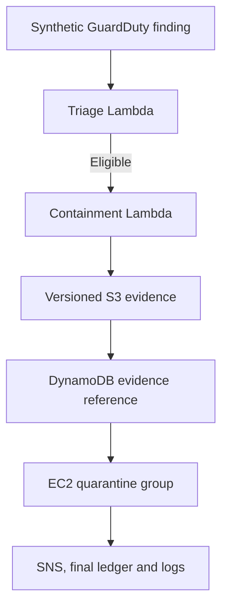

# Controlled EC2 Containment Validation

## Purpose

This document records the implementation and end-to-end validation of an automated incident-containment playbook for an AWS EC2 workload. The laboratory uses synthetic data and a disposable target so the workflow can demonstrate realistic cloud incident response without exposing a production asset.

The tested scenario models a high-severity Amazon GuardDuty finding associated with cryptocurrency mining. The triage layer maps the activity to MITRE ATT&CK technique **T1496.001 — Compute Hijacking**, under the **Impact** tactic.

## Response flow



1. A synthetic GuardDuty event is submitted to the triage Lambda.
2. Triage validates the finding, enriches it with live EC2 metadata, maps the MITRE technique, and decides whether containment is eligible.
3. The containment Lambda revalidates all safety conditions instead of trusting the triage response alone.
4. Before any EC2 mutation, the function serializes a canonical JSON snapshot containing the normalized finding, the decision and the live instance state.
5. The snapshot is created once under `incidents/<incident-id>/pre-containment.json`, with an S3 SHA-256 checksum and an S3 version ID. The function reads that exact version back and verifies both the downloaded bytes and the S3 checksum.
6. The bucket, key, checksum and version ID are written to the DynamoDB incident ledger while the processing lease is still held.
7. Only after those checks succeed is the target security group replaced with the ruleless quarantine security group.
8. The instance receives the `IncidentStatus=contained` tag while remaining powered on for investigation.
9. An SNS notification is published, the incident is finalized in DynamoDB, and structured events are written to CloudWatch Logs.
10. Reprocessing the same completed incident returns `already_contained` without repeating the mutation, notification or evidence write.

## Safety controls

The containment action is fail-closed and limited by the following controls:

| Control | Expected condition |
| --- | --- |
| Explicit authorization | EC2 tag `AutoContainment=true` |
| Synthetic target | EC2 tag `DataClassification=synthetic` |
| Clean initial state | EC2 tag `IncidentStatus=clean` |
| Resource allowlist | Instance ID must match the Terraform-managed target |
| Network baseline | Exactly one network interface and only the baseline security group |
| Supported power state | Instance must be in a state accepted by the playbook |
| Quarantine isolation | Quarantine security group contains no rules |
| Least privilege | Lambda role can modify only the lab instance and its quarantine security group |
| Evidence before mutation | EC2 is changed only after the S3 object is written, read back and verified |
| Immutable reference | S3 conditional creation, bucket versioning, SHA-256 and version ID protect retries |
| Evidence scope | Lambda S3 access is limited to `incidents/*` in the project evidence bucket |
| Idempotency | DynamoDB condition and incident status prevent duplicate mutation |
| Auditability | Before/after state, evidence location, checksums, timestamps, result, and failures are persisted |

The instance is intentionally kept running after isolation. This preserves volatile investigation context while network access is blocked by the quarantine security group.

## Previously recorded end-to-end baseline

The controlled test completed successfully with the following observable results:

| Validation | Result |
| --- | ---: |
| Foundation checks | 26 passed, 0 failed |
| Triage checks | 27 passed, 0 failed |
| Containment and idempotency checks | 54 passed, 0 failed |
| Python unit tests | 13 passed, 0 failed |
| Terraform drift check | Exit code 0 — no changes |
| Target recovery | Baseline security group restored; `IncidentStatus=clean` |

The successful containment run verified that:

- triage preserved the incident and finding identifiers;
- the target instance was enriched and approved for containment;
- the live EC2 security group changed from baseline to quarantine;
- the EC2 power state remained `running`;
- DynamoDB recorded `status=contained`, the target, the before/after state, TTL, and released processing lease;
- SNS reported the notification as published;
- CloudWatch recorded the `containment_complete` event;
- a second invocation returned `already_contained`, `Changed=false`, and `Idempotent=true`;
- the duplicate preserved the original completion time, quarantine state, and incident tag.

That result predates the S3 pre-containment evidence phase. It remains the regression baseline and must not be presented as proof of the new behavior.

## Pre-containment evidence validation

The updated unit suite adds four tests and passes all 12 containment tests locally:

- evidence is written and read back before `ec2:ModifyInstanceAttribute`;
- an S3 write failure blocks EC2 mutation and records the incident as `failed`;
- a checksum mismatch also blocks mutation;
- a retry of a failed incident reuses and verifies the exact stored version without overwriting it.
- a retry also recovers a valid object created before a previous DynamoDB reference update completed.

After deployment, `Test-Containment.ps1 -ExecuteContainment` additionally verifies the Lambda environment, response reference, DynamoDB reference, exact S3 object version, server-side encryption, S3 checksum, locally recomputed SHA-256, JSON contract and captured baseline state. With the added assertions, the expected summary is:

```text
Passed: 66
Failed: 0
```

Record this as an AWS-validated result only after the command succeeds in the laboratory account and the target has been recovered.

## Incident discovered during validation

### Symptom

The first live containment attempt failed with `UnauthorizedOperation` during the EC2 `ModifyInstanceAttribute` call. The target remained unchanged with the baseline security group and `IncidentStatus=clean`. DynamoDB correctly recorded the automation failure.

### Root cause

The Lambda role policy allowed `ec2:ModifyInstanceAttribute` on the EC2 instance ARN but omitted the quarantine security group ARN. The EC2 authorization check evaluated both resources involved in the security-group replacement.

This issue was not exposed by the unit tests because mocked SDK clients validate application behavior but do not reproduce AWS IAM authorization evaluation.

### Correction

The inline IAM policy was updated in place to authorize `ec2:ModifyInstanceAttribute` on exactly two resources:

- the Terraform-managed lab instance ARN;
- the Terraform-managed quarantine security group ARN.

No wildcard resource was introduced. Terraform applied one in-place IAM policy change with no resource creation or destruction. The subsequent end-to-end test passed all 54 checks.

### Preventive actions

- Keep the live test target disposable and limited to synthetic data.
- Retain an end-to-end test because unit mocks cannot prove effective IAM permissions.
- Review every AWS API mutation for all resources participating in its authorization decision.
- Inspect saved Terraform plans for unexpected creation, replacement, or deletion before applying them.
- Preserve structured failure records in DynamoDB and CloudWatch to support post-mortem analysis.
- Treat any S3 write, version or checksum verification failure as a containment blocker.

## Recovery runbook

After a successful containment demonstration, restore the disposable target before running the foundation and triage validations again.

Run these commands from the repository root in PowerShell:

```powershell
$labInstanceId = (
    terraform -chdir=".\infra" output -raw lab_instance_id
).Trim()

$baselineSgId = (
    terraform -chdir=".\infra" output -raw baseline_security_group_id
).Trim()

aws ec2 modify-instance-attribute `
  --instance-id $labInstanceId `
  --groups $baselineSgId `
  --profile cloud-ir-lab `
  --region us-east-1

aws ec2 create-tags `
  --resources $labInstanceId `
  --tags "Key=IncidentStatus,Value=clean" `
  --profile cloud-ir-lab `
  --region us-east-1
```

Then validate the recovered state:

```powershell
.\scripts\Test-Foundation.ps1
.\scripts\Test-Triage.ps1
python -m pytest ".\tests" -q

terraform -chdir=".\infra" plan `
  -parallelism=1 `
  -detailed-exitcode
```

Expected results are zero failed checks, all Python tests passing, and Terraform exit code `0`.

## Portfolio evidence

The implementation demonstrates practical experience with:

- AWS-native incident triage and controlled EC2 containment;
- Python automation with unit and end-to-end tests;
- least-privilege IAM troubleshooting;
- idempotent processing with DynamoDB;
- versioned pre-containment evidence with independently recomputed SHA-256;
- operational notification and logging through SNS and CloudWatch;
- infrastructure as code and drift detection with Terraform;
- post-incident recovery and post-mortem documentation;
- MITRE ATT&CK mapping for cloud compute hijacking.

## References

- [MITRE ATT&CK T1496.001 — Compute Hijacking](https://attack.mitre.org/techniques/T1496/001/)
- [Amazon GuardDuty EC2 finding types](https://docs.aws.amazon.com/guardduty/latest/ug/guardduty_finding-types-ec2.html)
- [Amazon EC2 ModifyInstanceAttribute API](https://docs.aws.amazon.com/AWSEC2/latest/APIReference/API_ModifyInstanceAttribute.html)
- [DynamoDB condition expressions](https://docs.aws.amazon.com/amazondynamodb/latest/developerguide/Expressions.ConditionExpressions.html)
- [Amazon S3 checking object integrity](https://docs.aws.amazon.com/AmazonS3/latest/userguide/checking-object-integrity.html)
- [Amazon S3 PutObject API](https://docs.aws.amazon.com/AmazonS3/latest/API/API_PutObject.html)
