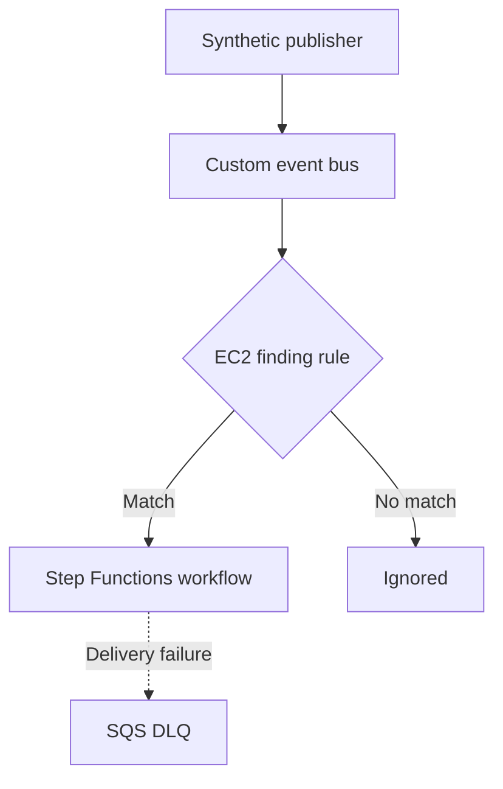

# EventBridge safe ingestion validation

## Purpose

This document describes the end-to-end validation of the Amazon EventBridge ingestion layer for the AWS Cloud Incident Response Automation Lab.

The validation proves that a synthetic GuardDuty-shaped EC2 finding can be published to an isolated custom event bus, matched by a constrained rule, delivered to the Step Functions incident-response workflow and safely rejected from containment when its severity is below the configured threshold.

## Architecture



The custom bus isolates laboratory events from the AWS account default bus. The source value is owned by the lab and does not impersonate the native `aws.guardduty` service source.

## Event routing controls

The rule is enabled and matches all of the following conditions:

| Field | Required value |
| --- | --- |
| `source` | `cloud-ir-lab.guardduty` |
| `detail-type` | `GuardDuty Finding` |
| `detail.resource.resourceType` | `Instance` |

This is intentionally fail-closed. A synthetic finding with a different resource type does not reach the workflow.

The EventBridge target configuration adds these controls:

- the target role can call only `states:StartExecution` on the laboratory state machine;
- failed target deliveries are retried at most twice;
- events older than one hour are no longer retried;
- failed deliveries are sent to an encrypted SQS dead-letter queue;
- the DLQ resource policy accepts `sqs:SendMessage` only from the specific EventBridge rule.

These delivery controls do not bypass the workflow guardrails. Triage still evaluates severity, target type, instance state and authorization metadata before containment can be considered.

## Safe end-to-end scenario

`Test-EventBridge.ps1` performs the following sequence:

1. Confirms that AWS CLI, Terraform and the synthetic finding template are available.
2. Resolves the deployed resources through Terraform outputs.
3. Confirms that the custom bus and rule exist and that the rule is enabled.
4. Reads the deployed event pattern and verifies all three required constraints.
5. Confirms that the rule has exactly one target: the incident-response state machine.
6. Confirms that the target role and SQS DLQ are configured.
7. Verifies that the EC2 target starts `clean` with only the baseline security group.
8. Reads the triage severity threshold and creates a unique finding one point below it.
9. Uses `test-event-pattern` to prove that the EC2 event matches.
10. Changes only `resourceType` to `S3Bucket` and proves that this event does not match.
11. Publishes exactly one low-severity event to the custom bus.
12. Correlates the Step Functions execution started by EventBridge.
13. Waits for the Standard Workflow to finish and verifies `SUCCEEDED`.
14. Confirms that triage returned `severity_below_threshold` and the workflow returned `skipped`.
15. Confirms that `TriageFinding` was entered and `ContainTarget` was not entered.
16. Confirms that the EC2 target remains unchanged and the DLQ remains empty.

## Command

Run from the repository root:

```powershell
.\scripts\Test-EventBridge.ps1
```

Capture the exit code immediately:

```powershell
$eventBridgeTestExitCode = $LASTEXITCODE

Write-Host `
  "EventBridge validation exit code: $eventBridgeTestExitCode"
```

Expected result:

```text
Passed: 37
Failed: 0
EventBridge validation exit code: 0
```

This test does not require an opt-in mutation flag. It always uses a severity below the deployed triage threshold and validates the non-containment path.

## Recorded validation

The AWS validation completed successfully on 2026-09-12.

The event-pattern checks returned:

```text
Synthetic EC2 finding:      Result=True
Non-EC2 finding:            Result=False
```

The end-to-end result was:

```text
EventBridge FailedEntryCount:  0
Step Functions status:         SUCCEEDED
Workflow result:               skipped
Containment eligible:          false
Skip reason:                   severity_below_threshold
Containment task entered:      false
Target incident status:        clean
Target security group:         baseline
DLQ messages:                  0
```

No real account ID, resource ARN, event ID, execution ARN or incident ID is recorded in this document.

## Evidence artifacts

The script prints a unique temporary directory containing the evidence for each execution.

| File | Evidence |
| --- | --- |
| `event-pattern.json` | Deployed rule pattern tested by the AWS API |
| `matched-event.json` | Exact synthetic EC2 event tested locally |
| `non-matching-event.json` | Same event with a non-EC2 resource type |
| `matched-pattern-result.json` | Positive event-pattern test result |
| `non-matching-pattern-result.json` | Negative event-pattern test result |
| `put-events-entries.json` | Entry submitted to the custom event bus |
| `put-events-response.json` | EventBridge acceptance response and event identifier |
| `list-executions.json` | Execution candidates used for correlation |
| `describe-execution.json` | Final workflow input, output and status |
| `execution-history.json` | State transition history |
| `final-instance.json` | EC2 state after the workflow completes |
| `final-dlq-attributes.json` | Final DLQ message counts |

These artifacts remain outside Git because they contain account-specific identifiers.

## Implementation corrections found during validation

### Windows PowerShell argument quoting

The first run passed the event pattern as inline JSON. Native-command argument processing removed JSON quotes before the value reached AWS CLI, producing `InvalidEventPatternException`.

The validator now serializes the deployed pattern to `event-pattern.json` and passes both the pattern and events using `file://` arguments. This removes dependence on shell quoting behavior and preserves the exact JSON sent to AWS CLI.

### Event timestamp normalization

The next run used the PowerShell round-trip format from `DateTimeOffset.ToString("o")`. The `test-event-pattern` operation rejected the resulting event envelope with `Invalid time`.

The validator now generates the event timestamp explicitly as UTC:

```text
yyyy-MM-ddTHH:mm:ssZ
```

The same normalized timestamp is applied to the top-level event `time` and the synthetic finding `createdAt` and `updatedAt` fields. After this correction, all 37 assertions passed.

## Failure investigation

If the validation fails after `PutEvents`, preserve the diagnostic directory and inspect the evidence in this order:

1. `put-events-response.json` for `FailedEntryCount` and per-entry errors.
2. `list-executions.json` to determine whether EventBridge started the workflow.
3. `describe-execution.json` for final status, error and cause.
4. `execution-history.json` for the last entered or failed state.
5. `final-dlq-attributes.json` for visible or delayed SQS messages.
6. The triage Lambda log group if the workflow entered `TriageFinding`.

Do not broaden the event pattern or IAM permissions merely to make a failed test pass. Isolate the failed delivery or state transition first.

## Cost controls

The test publishes one custom event and starts one short Standard Workflow execution. The SQS queue remains empty during a successful test and uses a four-day retention period for failed deliveries. No EventBridge archive or additional CloudWatch log group is enabled for this phase.

## Limitations

- the event is GuardDuty-shaped but synthetic;
- the source is laboratory-owned and the custom bus is isolated from native GuardDuty delivery;
- only the EC2 Instance resource type is routed;
- the validation covers successful delivery and an empty DLQ, not an intentionally failed target delivery;
- production adoption would require a dedicated threat model, GuardDuty integration, alert ownership and approval or escalation policy.

## References

- [Amazon EventBridge event buses](https://docs.aws.amazon.com/eventbridge/latest/userguide/eb-event-bus.html)
- [Amazon EventBridge event patterns](https://docs.aws.amazon.com/eventbridge/latest/userguide/eb-event-patterns.html)
- [Amazon EventBridge retry policy](https://docs.aws.amazon.com/eventbridge/latest/userguide/eb-rule-retry-policy.html)
- [Amazon EventBridge dead-letter queues](https://docs.aws.amazon.com/eventbridge/latest/userguide/eb-rule-dlq.html)
- [AWS CLI test-event-pattern](https://docs.aws.amazon.com/cli/latest/reference/events/test-event-pattern.html)
- [AWS CLI put-events](https://docs.aws.amazon.com/cli/latest/reference/events/put-events.html)
