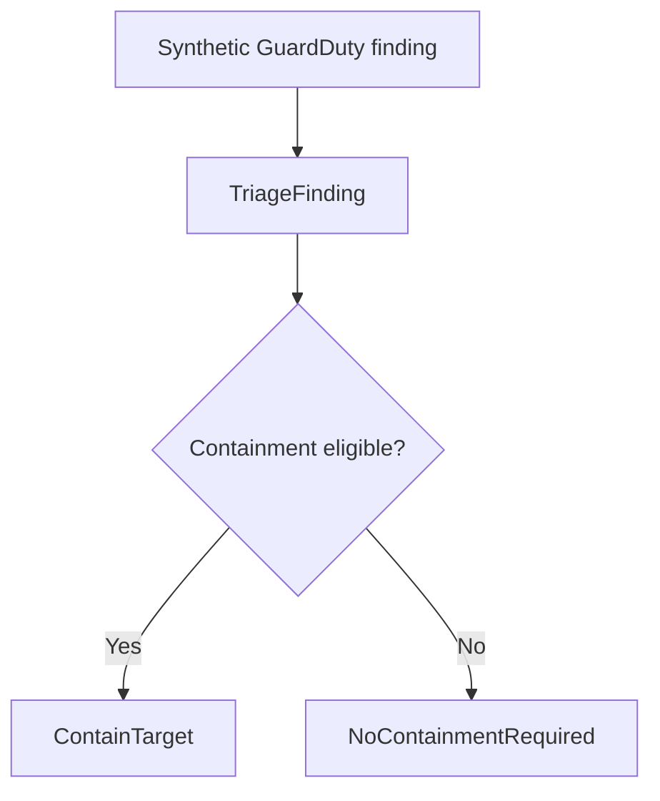

# Step Functions orchestration validation

## Purpose

This document describes the validation of the AWS Step Functions workflow that connects GuardDuty finding triage to controlled EC2 containment.

The validation covers two complementary paths:

- a safe skip path below the configured severity threshold, without changing the EC2 target;
- an explicitly authorized eligible path that invokes controlled containment and is followed by recovery to the baseline state.

## Architecture



The workflow is a Step Functions Standard Workflow. Its execution role can invoke only the triage and containment Lambda functions managed by this laboratory.

## Why Standard Workflow

Standard Workflow was selected because incident response benefits from durable state, exactly-once workflow execution semantics, and execution history that can be inspected through the API or console after completion.

The Lambda functions still implement their own safety and idempotency controls. Workflow-level guarantees do not replace resource-level revalidation.

## Workflow states

| State | Type | Purpose |
| --- | --- | --- |
| `TriageFinding` | Task | Invokes the triage Lambda with the original finding |
| `EvaluateContainmentEligibility` | Choice | Reads `decision.containment_eligible` |
| `ContainTarget` | Task | Invokes controlled containment only when explicitly eligible |
| `NoContainmentRequired` | Pass | Records that the workflow skipped mutation |
| `WorkflowFailed` | Fail | Terminates a failed task path for investigation |

Only transient Lambda service errors are retried automatically. Application and safety errors follow the failure path so an analyst can inspect the execution instead of repeatedly attempting an unsafe action.

## Safe validation scenario

`Test-Orchestration.ps1` performs the following checks:

1. Confirms that AWS CLI, Terraform and the synthetic finding template are present.
2. Resolves the deployed state machine and target through Terraform outputs.
3. Confirms that the workflow is active and uses type `STANDARD`.
4. Confirms that the target starts clean with the baseline security group.
5. Reads the current minimum severity from the triage Lambda.
6. Generates a unique finding below that threshold.
7. Starts a Step Functions execution and waits for completion.
8. Confirms that triage marked the finding as ineligible.
9. Confirms that execution history entered `TriageFinding` but never entered `ContainTarget`.
10. Confirms that the EC2 security group and incident tag remain unchanged.

The test does not insert a containment record into DynamoDB because the containment Lambda is intentionally not invoked on the skip path.

## Commands

Run from the repository root:

```powershell
.\scripts\Test-Orchestration.ps1
```

Capture the result immediately:

```powershell
$orchestrationExitCode = $LASTEXITCODE
Write-Host "Orchestration validation exit code: $orchestrationExitCode"
```

Expected result:

```text
Passed: 23
Failed: 0
Orchestration validation exit code: 0
```

## Recorded validation

The first AWS validation completed successfully on 2026-09-03:

```text
Passed: 23
Failed: 0
Orchestration validation exit code: 0
```

The execution history confirmed:

```text
TriageFinding=entered
ContainTarget=not-entered
```

Post-execution validation confirmed that the target remained `clean` and retained only the baseline security group.

Regression checks also completed successfully:

```text
Foundation: 26 passed, 0 failed
Python:     13 passed
Terraform:  No changes, exit code 0
```

## Authorized eligible-path validation

The eligible path was validated in AWS on 2026-09-03 with a unique synthetic finding, a severity above the deployed threshold and the disposable allowlisted EC2 target.

The Standard Workflow completed successfully and returned:

```text
Execution status:     SUCCEEDED
Incident status:      contained
Resource changed:     true
Idempotent replay:    false
Notification status:  published
```

The execution history confirmed that the intended states were entered in sequence:

```text
TriageFinding=entered
EvaluateContainmentEligibility=entered
ContainTarget=entered
```

The output and live AWS evidence agreed across the control plane:

| Evidence source | Recorded result |
| --- | --- |
| Step Functions output | `status=contained`, `changed=true`, `idempotent=false` |
| Execution history | Triage, choice and containment states entered |
| DynamoDB incident ledger | `status=contained`, completion timestamp and TTL present, processing lease absent |
| CloudWatch Logs | Structured `containment_complete` event for the same incident |
| SNS integration | Publish accepted with `notification_status=published` |
| EC2 before recovery | Quarantine security group and `IncidentStatus=contained` |

The evidence was collected in a temporary local directory and was not added to Git because it contained account-specific resource identifiers.

### Recovery validation

After evidence collection, the target was restored to the baseline security group and its `IncidentStatus` tag was returned to `clean`.

The post-recovery checks succeeded:

```text
Foundation:  26 passed, 0 failed
Terraform:   No changes, exit code 0
```

An earlier foundation run ended with a blank internal error after 25 successful checks. A direct Terraform plan immediately afterward returned `No changes`, and the complete foundation rerun passed 26/26. No infrastructure mutation or code correction was required, so this was recorded as a transient local/provider execution failure rather than an infrastructure defect.

## Failure investigation

If the execution does not succeed, do not start the containment test. Preserve the diagnostic directory printed by the script and inspect:

```powershell
aws stepfunctions describe-execution `
  --execution-arn <execution-arn> `
  --profile cloud-ir-lab `
  --region us-east-1
```

```powershell
aws stepfunctions get-execution-history `
  --execution-arn <execution-arn> `
  --profile cloud-ir-lab `
  --region us-east-1
```

Also inspect the triage or containment Lambda log group corresponding to the failed task.

## Cost controls

The laboratory does not enable Step Functions execution logging in this phase. Standard Workflow execution history is available natively, while the invoked Lambda functions continue writing their operational logs to CloudWatch.

This avoids a new log group and the broad CloudWatch Logs delivery permissions required by Step Functions logging. Only a small number of state transitions are used during validation.

## Operational observation: transient S3 refresh

The first Terraform drift check after orchestration validation incorrectly reported the evidence bucket as deleted and proposed recreating the S3 resource family.

The proposed plan was not applied. Direct checks confirmed that:

- `HeadBucket` succeeded for the expected account;
- classic S3 bucket tagging succeeded;
- S3 Control `ListTagsForResource` succeeded;
- DNS resolution and TCP port 443 for the S3 Control endpoint succeeded;
- all six S3 resources remained in Terraform state.

After clearing the local DNS cache, the next Terraform plan returned `No changes` with exit code `0`. No state removal, import or resource recreation was performed.

## Security properties

- The workflow role can invoke only the two laboratory Lambda functions.
- The read-only test cannot reach the containment task.
- The choice has an explicit default skip path.
- Missing or false eligibility never falls through to containment.
- The containment Lambda independently revalidates the instance, tags, interface count and security groups.
- No real account ID, ARN, instance ID or security group ID is stored in this document.

## Next automation step

Extend `Test-Orchestration.ps1` with an explicit opt-in parameter for the eligible path. The new mode must preserve the current safe behavior by default, verify authorization before mutation, collect Step Functions, DynamoDB and CloudWatch evidence, and restore the target automatically in a `finally` block.

## References

- [Invoke AWS Lambda with Step Functions](https://docs.aws.amazon.com/step-functions/latest/dg/connect-lambda.html)
- [Choice workflow state](https://docs.aws.amazon.com/step-functions/latest/dg/state-choice.html)
- [Choosing a Step Functions workflow type](https://docs.aws.amazon.com/step-functions/latest/dg/choosing-workflow-type.html)
- [GetExecutionHistory API](https://docs.aws.amazon.com/step-functions/latest/apireference/API_GetExecutionHistory.html)
- [DynamoDB time to live](https://docs.aws.amazon.com/amazondynamodb/latest/developerguide/TTL.html)
- [AWS Step Functions pricing](https://aws.amazon.com/step-functions/pricing/)
