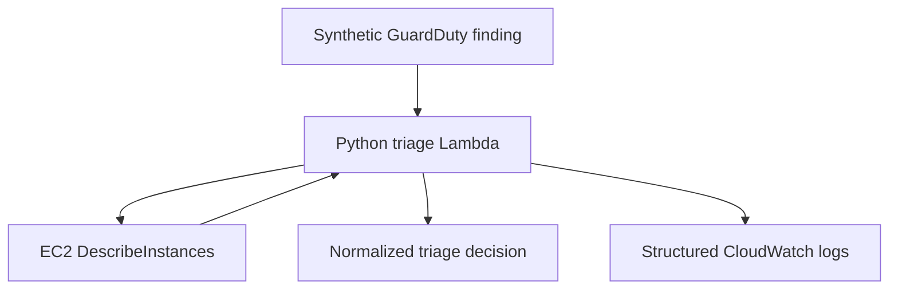

# GuardDuty Finding Triage Validation

## Validation status

| Field | Result |
|---|---|
| Status | Passed |
| Validation date | 2026-08-31 |
| AWS Region | `us-east-1` |
| Unit tests | 5 passed |
| Live validation controls | 27 passed, 0 failed |
| Destructive actions | None |

## Objective

Validate the read-only triage stage of the Cloud Incident Response
automation pipeline.

The triage function receives a GuardDuty-compatible finding, validates its
structure, enriches the affected EC2 resource, maps the activity to MITRE
ATT&CK, and determines whether the incident is eligible for automated
containment.

This stage does not modify the affected instance.

## Components

| Component | Purpose |
|---|---|
| `src/triage/handler.py` | Finding normalization, enrichment and decision logic |
| `tests/test_triage.py` | Isolated unit tests |
| `events/guardduty-crypto-ec2.json` | Synthetic GuardDuty-compatible event |
| `infra/triage.tf` | Lambda, IAM role, policy and CloudWatch log group |
| `scripts/Test-Triage.ps1` | Live validation against the deployed AWS resources |

## Data flow



The synthetic event represents an EC2 cryptocurrency-mining finding. The
Lambda queries EC2 only to enrich the finding and does not perform containment.

## Implemented decision controls

A finding is eligible for automated containment only when all the following
conditions are satisfied:

1. The event contains the required GuardDuty finding fields.
2. The severity is greater than or equal to `MIN_SEVERITY`.
3. The affected resource is an EC2 instance.
4. The instance has the tag `AutoContainment=true`.
5. The instance is in a supported state.
6. The finding type has a supported MITRE ATT&CK mapping.

For this lab, `MIN_SEVERITY` is configured as `7`, corresponding to the
beginning of the GuardDuty High severity range.

## Validated scenario

| Attribute | Value |
|---|---|
| Finding type | `CryptoCurrency:EC2/BitcoinTool.B!DNS` |
| Severity | `8` |
| Resource | EC2 instance |
| Authorization tag | `AutoContainment=true` |
| Initial incident status | `clean` |
| MITRE technique | `T1496.001` |
| MITRE technique name | Compute Hijacking |
| MITRE tactic | Impact |
| Containment eligibility | `true` |
| Blocking reasons | None |

The instance identifier and other live AWS resource identifiers are
intentionally excluded from this document.

## Validation results

| Validation group | Passed |
|---|---:|
| Tool and event preflight | 3 |
| Lambda configuration | 6 |
| Target preconditions | 4 |
| Synchronous invocation | 2 |
| Normalization, enrichment and decision | 9 |
| No-side-effect verification | 2 |
| CloudWatch observability | 1 |
| **Total** | **27** |

## Unit tests

The isolated test suite covers the following scenarios:

1. Authorized high-severity finding is eligible.
2. Low-severity finding is not eligible.
3. Missing authorization tag blocks containment.
4. Unsupported instance state blocks containment.
5. Malformed finding is rejected.

Run the tests from the repository root:

```powershell
python -m pytest ".\tests\test_triage.py" -q
```

Expected result:

```text
5 passed
```

## Live validation

Run the integration validation from the repository root:

```powershell
.\scripts\Test-Triage.ps1
```

Expected summary:

```text
Validation summary
Passed: 27
Failed: 0
```

The script validates both the result returned by Lambda and the absence of
unauthorized side effects on the target EC2 instance.

## Security design decisions

### Explicit authorization

Automated containment is denied unless the affected resource contains the tag
`AutoContainment=true`.

This creates an explicit boundary between resources authorized for the lab and
any unrelated resources in the AWS account.

### Separation between triage and containment

The triage Lambda is read-only. It determines eligibility but does not change
security groups, instance state or incident tags.

Containment will be implemented as a separate stage with a separate IAM role.

### Least-privilege execution role

The triage role contains only the permissions required to:

- describe EC2 instances;
- create Lambda log streams;
- write events to the dedicated CloudWatch log group.

No EC2 mutation actions are granted to this role.

The `ec2:DescribeInstances` action uses resource `"*"` because this EC2
Describe operation does not support resource-level scoping.

### No VPC attachment

The Lambda is not attached to the isolated lab VPC. It only needs access to AWS
service APIs and does not need network connectivity to the target instance.

This avoids introducing a NAT Gateway or additional VPC endpoints solely for
the triage stage.

### Synthetic security event

The validation uses a local GuardDuty-compatible event. It does not create
malware, execute cryptocurrency-mining software or compromise the EC2
instance.

### Log retention

The dedicated CloudWatch log group retains operational logs for seven days,
limiting unnecessary long-term storage in the lab.

## Observed runtime sample

A cold-start invocation observed during deployment produced the following
sample:

| Metric | Observed value |
|---|---:|
| Function duration | 393.83 ms |
| Initialization duration | 627.93 ms |
| Billed duration | 1022 ms |
| Configured memory | 128 MB |
| Maximum memory used | 104 MB |

This is a single functional validation sample and must not be treated as a
performance benchmark.

## Current limitations

- Invocation is currently manual and synchronous.
- GuardDuty and EventBridge are not connected yet.
- The triage function does not persist incidents.
- The triage function does not perform containment.
- Idempotency is not implemented yet.
- Notifications and response orchestration are not connected yet.
- Runtime-included Boto3 is used by the lab package.
- No load or concurrency testing has been performed.

## Next phase

The next stage will implement controlled containment with:

1. a separate least-privilege Lambda role;
2. an explicit eligibility check;
3. replacement of the baseline security group by the quarantine group;
4. incident state persistence in DynamoDB;
5. evidence preservation;
6. idempotency and duplicate-event handling;
7. automated rollback and validation controls.

## References

- [AWS GuardDuty severity levels](https://docs.aws.amazon.com/guardduty/latest/ug/guardduty_findings-severity.html)
- [AWS Lambda execution roles](https://docs.aws.amazon.com/lambda/latest/dg/lambda-intro-execution-role.html)
- [AWS Lambda functions with Python](https://docs.aws.amazon.com/lambda/latest/dg/lambda-python.html)
- [MITRE ATT&CK T1496.001 - Compute Hijacking](https://attack.mitre.org/techniques/T1496/001/)